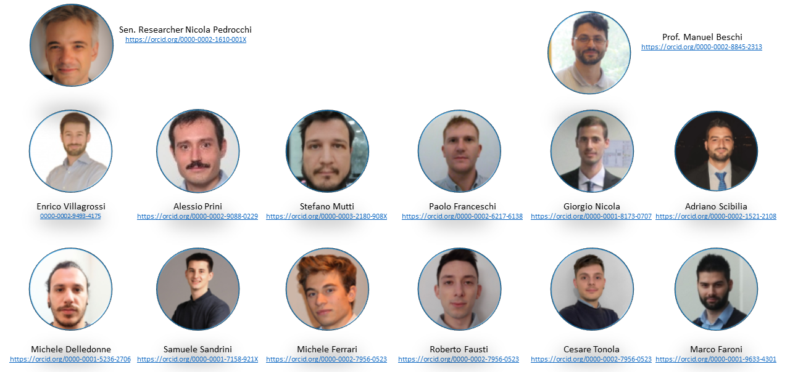

I’m a senior researcher at the National Council of Research of Italy. I am the head of the Personal Robotics for Manufacturing Laboratory ([PERFORM](https://www.stiima.cnr.it/about-stiima/laboratories-and-shopfloors/personal-robotics-for-manufacturing-laboratory/?lang=en)), and I supervise the Intelligent Industrial Robotics ([IINFORM](https://www.stiima.cnr.it/about-stiima/laboratories-and-shopfloors/intelligent-industrial-robotics-for-manufacturing-laboratory/?lang=en)) at the Institute of Intelligent Industrial Technologies and Systems for Advanced Manufacturing ([STIIMA](https://www.stiima.cnr.it/?lang=en)), Milan, Italy.

I also co-lead with Prof. [Manuel Beschi](https://manuel-beschi.unibs.it/) the Laboratory "Controlli Automatici per la Robotica Idnustriale" ([CARI](https://cari.unibs.it/)), a joint laboratory between CNR and the Department of Industrial and Mechanical Engineering of the University of Brescia.

My main research interest is in motion planning and control in challenging scenarios (e.g., planning with unreliable models and human-robot collaboration),  AI techniques for human-aware decision-making, and robust integration of advanced control strategies in TRL5+ industrial applications. I am also involved in the conception and deployment of robotic systems for human assistance and rehabilitation.

I have been supervising about 20 PhD students in the last 15 years, and involved in tens of different funded projects.

Contact
------

  **Address**:       via A. Corti 12, 20133 Milan, Italy 
  **Department**:    Institute of Intelligent Industrial Technologies and Systems for Advanced Manufacturing (STIIMA) 
  **Institution**:   National Research Council of Italy (CNR) 
  **Mobile**:        +393665797833 
  **Email**:         nicola.pedrocchi[at]stiima.cnr.it 
  **Scopus Author ID**: [14016736100](https://www.scopus.com/authid/detail.uri\?authorId=14016736100) 
  **WoS Researcher ID**: [B-3188-2014](https://www.webofscience.com/) 
  **Orcid ID**: [0000-0002-1610-001X](https://orcid.org/0000-0002-1610-001X) 
  **LinkedIn**: [nicola-pedrocchi](https://www.linkedin.com/in/nicola-pedrocchi/) 
  **Research Gate**: [Nicola Pedrocchi](https://www.researchgate.net/profile/Nicola_Pedrocchi) 
  **Google Scholar**: [Nicola Pedrocchi](https://scholar.google.com/citations?user=UpiG-f8AAAAJ&hl=en) 

The Research Team
------

